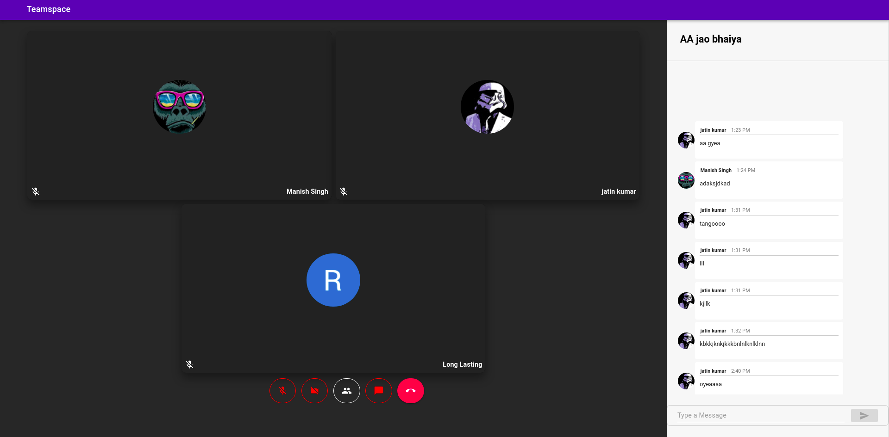
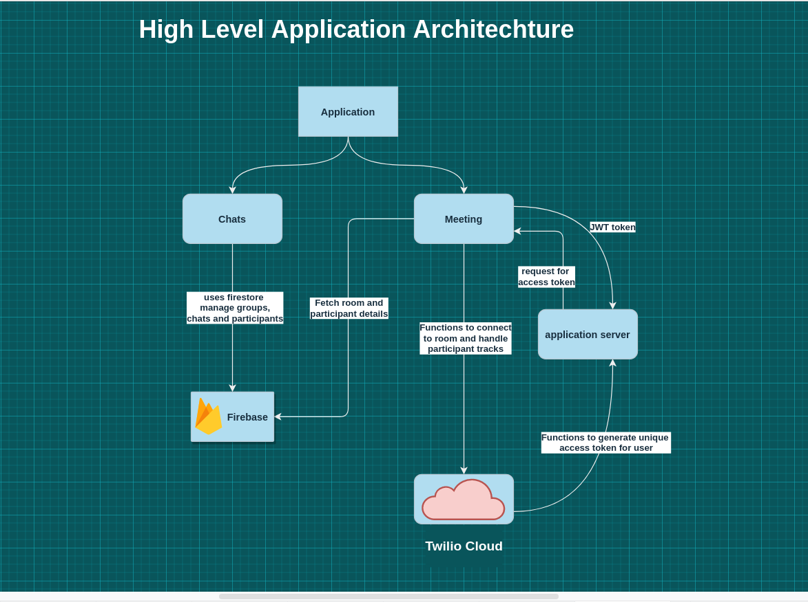

# [Teamspace]("https://teams-clone-c6129.web.app/")

**Build a Microsoft Teams Clone with Acehacker, in Microsoft Engage 2021**

[Teamspace]("https://teams-clone-c6129.web.app/")

## Overview

This application is part of the submission for the Microsoft Engage 2021. We were given a task to build [Microsoft Teams](https://www.microsoft.com/en-in/microsoft-teams/group-chat-software) clone with a minimum functionality that two people should be able to communicate with each other through video calls.

## Application


## Features

This application has following features:
* Create groups with friends, colleagues and family,
* Video conferencing with real-time audio and video
* Chats with textual messaging.
* enable/ disable camera.
* mute/unmute mic.

## Technologies Used:

* [ReactJS]("https://reactjs.org") 
* [NodeJs]("https://nodejs.org)
* [Firebase]("https://firebase.google.com)
* [Twilio Progammable-Video API]("https://www.twilio.com/docs/video")


## Architechture

This application has two main components Chats and Meeting. Authentication is handled using firebase AuthProvider. Chat components uses firestore for storing groups/meetings, messages, and participant's information.
Meeting component uses firestore for fetching room and participant details. It uses the application to generate an access token for each participant everytime they join a meeting.This component uses the Twilio Programmable-Video API to connect and create rooms, and to manage participants in the meeting.

## Future Scopes

Things to implement in near future:
* Screen sharing
* Chats with file sharing support,
* Email invites to members,
* Calendar support
* Roles to members


## Setting up a local development environment

### Installing npm dependencies
To install the required dependencies run
```bash
    npm install
```
### Setup a Local server for access_token

To set up a local server for access_token visit [here]("https://github.com/7TRED/teams-clone-server.git")

### To run the app in development mode run the below command
```bash
    npm start
```
This will run the application on localhost:3000 by default.


## Building and deploying the app:
This application is deployed on firebase.
* To deploy your own application you need to setup a project on firebase and replace the example firebaseConfig in ``Firebase/index.js`` folder with your project's firebase configurations.

* Install firebase-cli by running the below command:
```bash
    npm install -g firebase-tools
```
* Build the react project by running the below command:
```bash
    npm run build
```

* Deploy on firebase by running:
```bash
    firebase deploy
```


