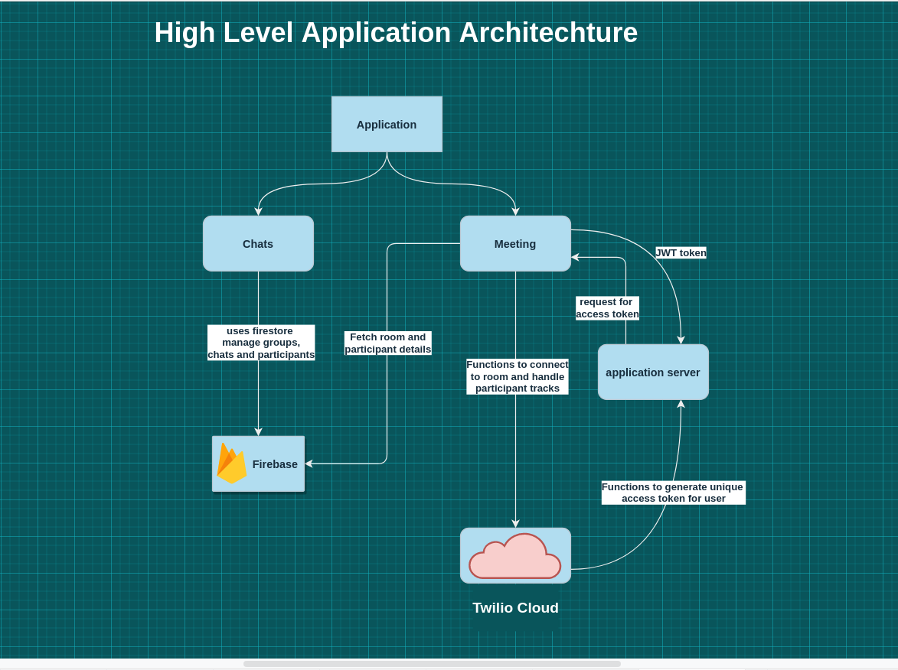
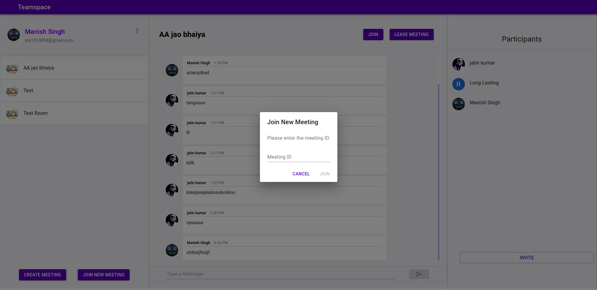
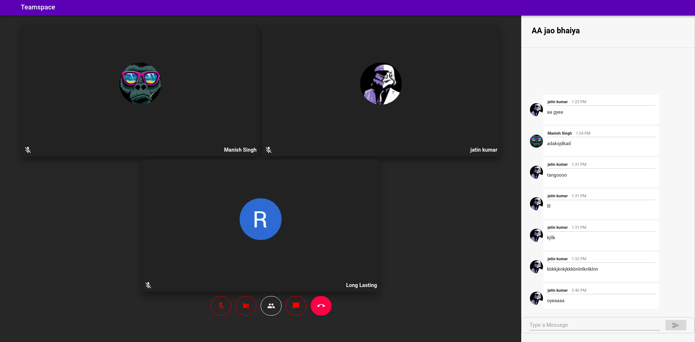

# Teamspace

## Overview

### Microsoft Engage 2021 - Agile Development
This application is part of the submission for the Microsoft Engage 2021. We were given a task to build [Microsoft Teams](https://www.microsoft.com/en-in/microsoft-teams/group-chat-software) clone with a minimum functionality that two people should be able to communicate with each other through video calls.We were alloted mentors to help us and encourage us to complete the challenge as well as to follow the best code practices and how to approach the problem. 

The Acehacker team regularly conducted AMA sessions, multiple Leader sessions, workshop on Azure Communication Services and an interactive session with this year's microsoft interns. 

The Journey of last one month was amazing, the excitement of working on a real world project and the doubt whether we'll be able to complete it or not,these mixed feelings made this journey thrilling. I learned a lot of new things, this opportunity gave me a chance to connect with people, observe how other people think and tackle a problem and learn from them.
Mentors were super supportive they taught us to ask right questions while approaching a problem.They taught us to look for right things and at right places. They showed us path to become a great developer.

## Teamspace 

During the period of last month, I built a video meeting and chat application using ``ReactJs, NodeJs, Firebase and Twilio Programmable Video API``. You can use the application [here]("https://teams-clone-c6129.web.app/")

### Key Features:
This application has following key features:
* Create groups with friends, colleagues and family,
* Video conferencing with real-time audio and video
* connect upto 15 participants at a time in a meeting
* Chats with textual messaging.
* enable/ disable camera.
* mute/unmute mic.

## Teamspace Architechture

Authentication in Teamspace is handled by [Firebase GoogleAuthProvider]("https://firebase.google.com/docs/reference/js/firebase.auth.GoogleAuthProvider"). The chat feature is implemented by using firebase firestore, which manages groups/meetings, messages in groups and particpants.

The Meetings feature is implemented by using the [Twilio Progammable-Video API]("https://www.twilio.com/docs/video"), it provides API for creating rooms, connecting to rooms, and managing participants and their tracks in the meeting.

Teamspace's application server is used to generate access token for every particpant, everytime they join a meeting. It uses the functions provided by the ``Twilio Programmable Video SDK`` to generate those access tokens.

## Future Scopes
* Screen sharing support
* Chats with textual messaging and file sharing
* Sending email invites
* Calendar support
* Roles in meetings and teams

## ``How To Guide``

## Creating Groups/Meetings

To be able to create a group you need to be signed-in first in the application. 

To create a new meeting click on the button at the bottom left corner, a dialog box will open which will require you to enter a meeting name and meeting description. Fill those details and click on create. A new meeting will be created.

## Join new group/Meetings
To be able to join a new group you need to be signed-in.

To join a new group/meeting click the ``Join New Meeting`` button on the bottom left corner. A dialog box will open which will require you to enter the meeting's id shared with you. Enter a valid meeting ID and click join.
You will join the meeting.

## Inviting people 

To invite people in your group click on the ``Invite`` button at the bottom right corner of the screen. A dialog box with your current meeting url will be shown. Copy the url and share it with you team members.

In order to join the meeting they will have to sign in first.

## Join a meeting Room 

There are two ways to Join a meeting room.

* By clicking the join button in the Chat header.
* By the shared meeting URL. When using this metho, if you are not signed in you will be asked to sign in first and then will be redirected to the preview screen.

Here you will be given choice to keep your camera and mic on or off. You have to allow camera and mic permissions to join the meeting.

After setting up your media you can click on the join button to continue to the room. 

## References

* [ReactJs]("https://reactjs.org/docs/getting-started.html")
* [WebRTC MDN]("https://developer.mozilla.org/en-US/docs/Glossary/WebRTC")
* [Twilio Programmable Video API]("https://www.twilio.com/docs/video")
* [Firebase]("https://firebase.google.com/docs/")
